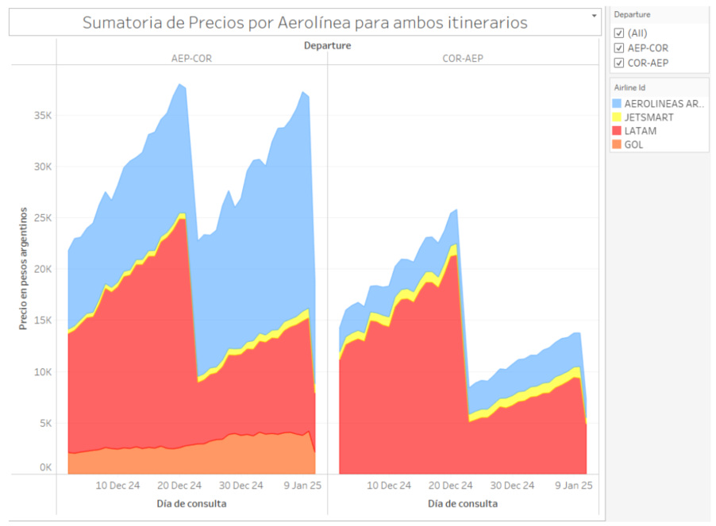

# PROYECTO FINAL - IN PROGRESS
## Evoulución de costos de pasajes en Aerolíneas
1. Introducción
   
Este proyecto surge como necesidad de analizar los cambios que se producen en los valores de los
pasajes ofrecidos de diferentes líneas aéreas en particular para una ruta específica, desde el
aeropueto metropolitano Aeroparque Jorge Newbery ubicado en la Ciudad de Buenos Aires hasta
el aeropuerto de la Provincia de Córdoba, observando sólo un itinerario de vuelo. Es decir, para los
pasajes de ida y vuelta en una fechas particulares.
Esta ruta es una de las más transitadas en nuestro país, por ser también un hub internacional y por
ser un destino turístico para miles de personas. En un contexto de recesión en Argentina, cuyo
cambio de la moneda nacional no es favorable para los turistas extranjeros, es posible que las líneas
aéreas apuestan al mercado interno.
Asimismo, surge como curiosidad para determinar efectivamente los cambios que eventualmente
la líneas aéreas promueven en determinados momentos del día, del mes, etc.

2. Objetivos del Proyecto
   
Disponibilizar una base datos sólida con el objetivo de visualizar una curva temporal de los cambios
de precios en los pasajes aéreos. A su vez:
- Desarrollar un pipeline ELT robusto y escalable para extraer, cargar y transformar datos de una
API.
- Almacenar los datos procesados en Aiven Cloud. Plataforma open source de almacenamiento
de datos confiable y escalable.
- Transformar y limpiar los datos para garantizar su calidad y consistencia, preparándolos para el
análisis posterior.
- Visualización de los datos utilizando la herramienta de presentación Tableau.

3. Diseño de la solución
   
3.1. Arquitectura del Pipeline

Durante la ejecución del pipeline se utilizó el orquestador Airflow, mediante una imagen de Docker
para el procesamiento de las canalizaciones.
El pipeline ETL se compone de las siguientes etapas:
- Extracción (E): En esta etapa, se extraen datos de las API SerpAPI. Allí se ofrecen una gran
variedad de información de diferentes naturalezas. Desde su suscripción gratuita se pueden
hacer hasta 100 consultas por mes.
A partir de la extensión ‘flights’, la idea inicial en términos generales, sería realizar una lectura
por hora en al menos 10 itinerarios de interés que el usuario podría configurar a sus preferencias.
a información suministrada por cada vuelo es muy diversa. Utiliza el motor de Google Flights
para la lectura. Por lo que optamos en guardar todo el archivo json en una ubicación local a los
efectos de tenerlos presente por si se quiere, a futuro, utilizar esa información para otro análisis.
- Transformación (T): Una vez obtenido los datos crudos, se procede a leerlos y manipularlos como
dataframe utilizando las herramientas provistas por pandas. En primera instancia se utilizó
scripts de python con Spark, pero luego, con la utilización de Airflow no fue necesario teniendo
en cuenta que el volumen de datos por cada consulta no es muy grande.
Luego, se guarda la información en archivos .csv.
- Carga (L): Se leen los archivos .csv y se los carga a la base de datos PostgreSQL, previamente
configurado en Airflow. La base de datos está alojada en Aiven Cloud, el cual es un host gratuito
y confiable.
También se utilizó la aplicación de escritorio DBeaver para la gestión, control de la base de datos.

La base de datos fue creada previamente mediante Dbeaver. La misma rige bajo el sigueinte ERD,
el cual permite ampliarlo en caso de que sea necesario, el cual puede ser obtenido mediante los
archivos json que se encuentran almacenados en nuestro repositorio local.

El pipeline obtenido mediante Apache Airflow se visualiza a continuación.

3.2 Desarrollo Técnico
- Lenguaje de programación: Python para la extracción y transformación de datos. SQL para la
gestión de almacenamiento en la base de datos.
- Herramientas: Apache Airflow, Pandas, PostgreSQL, Tableau.

3.3 Dashboard en Tableau
- Histograma por vuelo: Se representa por cada vuelo en cada una de las etapas (AEP-COR y CORAEP) los cambios que han sufrido el valor de los pasajes.
- Histograma por línea aérea: Se visualiza el precio total por cada línea aérea.

4. Evaluación del Proyecto
El proyecto se realizó teniendo en cuenta las consideraciones propuestas, las mejores prácticas. Si
bien, en esta primera etapa hay muchas asuntos por corregir y mejorar se presenta con una
calidad de código aceptable y documentado.
La automatización fue configurada mediante Apache Airflow.

5. Siguientes Pasos
En esta primera aproximación por el mundo de la ingeniería de datos y su implementación práctica
surge la necesidad de continuar investigando con el fin de obtener mayor cantidad de datos por día,
para distintas fechas, mayor cantidad de aerolíneas y distintas rutas.
A su vez, sería oportuno disponibilizarlo y ejecutarlo en algún proveedor de nube. Proporcionando
de esta manera, la escalabilidad, seguridad y eficiencia de procesamiento.
Como curiosidad adicional, una vez obtenido una cantidad suficiente de datos probablemente
puedan ser utilizados para abastecer un modelo de aprendizaje automático en el cual pueda
predecir en qué momento es oportuno comprar un pasaje si uno ya tiene pensado viajar a un
destino de interés en los próximos meses por ejemplo. Esto es posible utiilzando las herramientas proporcionadas por los proveedores de nube, como Azure, el cual ofrece una gran capacidad de
procesamiento.

6. Conclusiones
En una primera aproximación a la ingeniería de datos, este informe generó un gran desafío,
principalmente por el hecho de mi leve experiencia en el área, y por la necesidad y el compromiso
de obtener los conocimientos provistos en este Bootcamp.
Tan desafiante fue este proyecto que, a pesar de mis limitaciones prácticas, fue satisfactorio obtener
pequeños resultados a partir de la iteración en el proceso de escritura, análisis de los lenguajes.
Pude notar cómo me fui familiarizando con las diferentes tecnologías y documentación formal que
proveen las herramientas utilizadas. Aunque el resultado no fue lo esperado ya que el pipeline no
está finalizado y operativo, he disfrutado del proceso y esto reinvindica mis intenciones de continuar
en la ruta de aprendizaje con el objetivo final de obtener un empleo en esta área de la ingenieria y
el mundo IT.
Quiero aprovechar esta oportunidad para agradecer a todo el staff de CodigoFacilito por brindarnos
estas capacitaciones con el más alto nivel de profesionalismo y dedicación.

7. Referencias
- Fundamentals of Data Engineering, June 2022, Joe Reis, Matt Housley, O’Reilly.
- https://www.postgresql.org/docs/
- https://airflow.apache.org/docs/
- https://aiven.io/docs/
- https://pandas.pydata.org/docs/
- https://docs.python.org/3/
- Curso de Apache Airflow – Introducción a la Orquestación de Flujos de Datos,
CódigoFacilito
- Bootcamp Replays – Bootcamp de Ingeniería de Datos